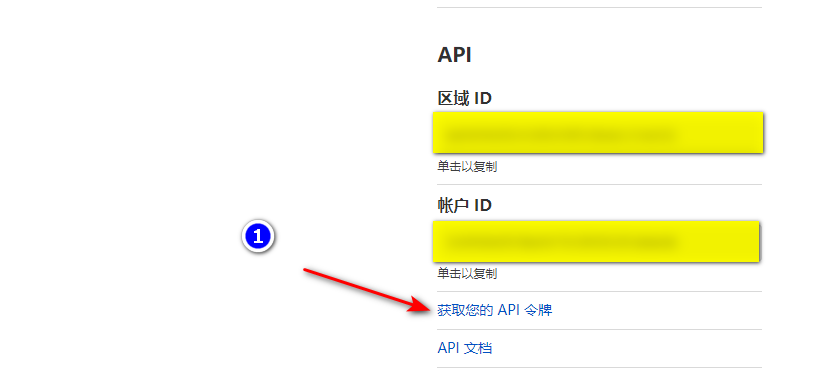

<!--
# SEO: x-ui на русском языке, x-ui русский интерфейс, x-ui русифицированная версия, x-ui русская панель, x-ui панель на русском языке, x-ui Xray V2Ray русская версия, русификатор x-ui, x-ui перевод на русский язык, x-ui русская локализация, x-ui ru, x-ui russia, x-ui russian version, x-ui russian translation, x-ui for Russians, x-ui dashboard russian, x-ui xray v2ray ru, x-ui xray v2ray russian, x-ui GUI на русском, x-ui админка на русском, x-ui xray панель на русском, x-ui v2ray панель на русском, x-ui для русскоязычных, x-ui для России, x-ui интерфейс на русском, панель управления Xray на русском, панель управления V2Ray на русском, x-ui локализация, x-ui для русского VPS, x-ui русская сборка, x-ui русский язык, xray dashboard ru, xray gui russian, v2ray x-ui ru, x-ui translation russian, x-ui язык русский
-->

# x-ui-ru — русская версия панели управления Xray/V2Ray

> **Русский перевод x-ui для Xray/V2Ray** — полностью русифицированная панель управления для Xray и V2Ray. Перевод интерфейса и скриптов на русский язык выполнен [bozhenkas](https://github.com/bozhenkas)
> 
> Оригинальный автор и репозиторий: [vaxilu/x-ui](https://github.com/vaxilu/x-ui)

---

## Что это такое?

**x-ui** — это самая популярная и удобная панель управления для Xray/V2Ray, теперь полностью на русском языке! Если вы искали:

- x-ui на русском
- x-ui русский перевод
- xray ru
- x-ui русификатор
- x-ui для России
- x-ui Xray V2Ray русская версия
- x-ui russian
- x-ui ru
- x-ui russia
- x-ui xray v2ray ru
- x-ui xray v2ray russian
- x-ui xray v2ray русский перевод

— вы попали по адресу!

---

## О проекте

**x-ui** — это современная панель управления для Xray/V2Ray с удобным веб-интерфейсом, поддержкой различных протоколов и гибкой настройкой пользователей и серверов.

- Полностью переведён на русский язык (без иероглифов)
- Удобный и понятный интерфейс
- Поддержка популярных протоколов (VMess, VLESS, Trojan, Shadowsocks и др.)
- Гибкая настройка пользователей, портов, сертификатов и т.д.
- Telegram-уведомления, статистика, автоматизация

---

## Быстрый старт (установка x-ui на русском)

1. Скачайте и запустите скрипт установки:

```bash
bash <(curl -Ls https://raw.githubusercontent.com/bozhenkas/x-ui-ru/master/install.sh)
```

2. Следуйте инструкциям в терминале.

3. После установки панель будет доступна по адресу: `http://<ваш_IP>:54321`

---

## Особенности перевода

- Переведены все скрипты, интерфейс, сообщения и шаблоны
- Удалены все китайские иероглифы из пользовательских сообщений
- Оставлены только русский и английский языки
- Подходит для пользователей из России и русскоязычных стран

---

## 💖 Поддержать проект

Если вам понравился проект и вы хотите его поддержать — буду рад вашей помощи!

[](https://yoomoney.ru/to/410016326432554)

Вы также можете перейти напрямую по ссылке:  
👉 [https://yoomoney.ru/to/410016326432554](https://yoomoney.ru/to/410016326432554)

---

**Спасибо за использование x-ui на русском!**

---

## Описание возможностей

- Мониторинг состояния системы
- Поддержка нескольких пользователей и протоколов, визуальное управление через веб-интерфейс
- Поддерживаемые протоколы: vmess, vless, trojan, shadowsocks, dokodemo-door, socks, http
- Гибкая настройка параметров передачи
- Статистика трафика, ограничение трафика и срока действия
- Возможность кастомизации шаблона конфигурации xray
- Поддержка доступа к панели по https (собственный домен + ssl-сертификат)
- Поддержка автоматического получения и продления SSL-сертификата в один клик
- Дополнительные расширенные настройки — см. панель управления

---

## Установка и обновление

```bash
bash <(curl -Ls https://raw.githubusercontent.com/bozhenkas/x-ui-ru/master/install.sh)
```

---

## Ручная установка и обновление

1. Скачайте последнюю версию архива с https://github.com/bozhenkas/x-ui-ru/releases, обычно выбирайте архитектуру `amd64`
2. Загрузите архив на сервер в папку `/root/` и войдите под пользователем `root`

> Если архитектура вашего процессора не `amd64`, замените `amd64` в командах на нужную архитектуру

```bash
cd /root/
rm x-ui/ /usr/local/x-ui/ /usr/bin/x-ui -rf
tar zxvf x-ui-linux-amd64.tar.gz
chmod +x x-ui/x-ui x-ui/bin/xray-linux-* x-ui/x-ui.sh
cp x-ui/x-ui.sh /usr/bin/x-ui
cp -f x-ui/x-ui.service /etc/systemd/system/
mv x-ui/ /usr/local/
systemctl daemon-reload
systemctl enable x-ui
systemctl restart x-ui
```

---

## Установка через docker

> Данный раздел и docker-образ предоставлены [Chasing66](https://github.com/Chasing66)

1. Установите docker

```bash
curl -fsSL https://get.docker.com | sh
```

2. Установите x-ui

```bash
mkdir x-ui && cd x-ui
docker run -itd --network=host \
    -v $PWD/db/:/etc/x-ui/ \
    -v $PWD/cert/:/root/cert/ \
    --name x-ui --restart=unless-stopped \
    enwaiax/x-ui:latest
```

> Сборка собственного образа

```bash
docker build -t x-ui .
```

---

## Получение SSL-сертификата

> Данный раздел и скрипт предоставлены [FranzKafkaYu](https://github.com/FranzKafkaYu)

Скрипт поддерживает автоматическое получение SSL-сертификата. Для этого необходимы:

- Email, зарегистрированный в Cloudflare
- Cloudflare Global API Key
- Домен, уже направленный на ваш сервер через Cloudflare

Как получить Cloudflare Global API Key:



Для использования просто введите `домен`, `email`, `API KEY` — пример:


Важные замечания:

- Скрипт использует DNS API для получения сертификата
- По умолчанию используется Let'sEncrypt как CA
- Сертификаты сохраняются в папке /root/cert
- Все сертификаты — wildcard (для всех поддоменов)

---

## Использование Telegram-бота (разработка, временно недоступно)

> Данный раздел и скрипт предоставлены [FranzKafkaYu](https://github.com/FranzKafkaYu)

X-UI поддерживает уведомления о трафике, входе в панель и другие события через Telegram-бота. Для использования необходимо самостоятельно зарегистрировать бота.
Инструкция по регистрации: [ссылка на блог](https://coderfan.net/how-to-use-telegram-bot-to-alarm-you-when-someone-login-into-your-vps.html)

В настройках панели укажите:
- Токен Telegram-бота
- ChatId Telegram-бота
- Периодичность уведомлений (формат crontab)

Примеры crontab:
- 30 * * * * * // уведомление каждую минуту на 30-й секунде
- @hourly      // каждый час
- @daily       // ежедневно (в полночь)
- @every 8h    // каждые 8 часов

Уведомления Telegram:
- Использование трафика по узлам
- Вход в панель
- Истечение срока действия узла
- Предупреждение о превышении трафика

Планируется расширение функционала...

---

## Рекомендуемые системы

- CentOS 7+
- Ubuntu 16+
- Debian 8+

---

## Часто задаваемые вопросы

### Миграция с v2-ui

Сначала установите последнюю версию x-ui на сервер с v2-ui, затем выполните команду для миграции всех inbound-аккаунтов из v2-ui в x-ui (настройки панели и логин/пароль не переносятся):

> После успешной миграции обязательно `выключите v2-ui` и `перезапустите x-ui`, иначе inbound из v2-ui и x-ui могут конфликтовать по портам

```bash
x-ui v2-ui
```

---

### Закрытие issue

Вопросы, связанные с ошибками в вашей конфигурации, решайте самостоятельно. Issues предназначены только для багов панели.

[](https://starchart.cc/vaxilu/x-ui) 
